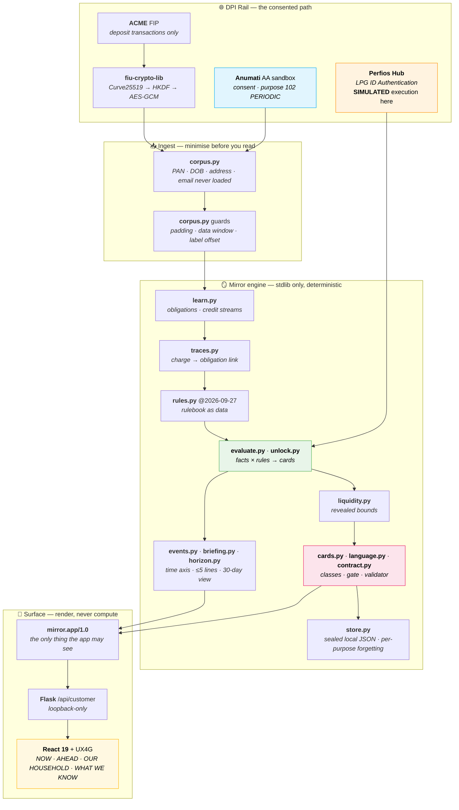

<div align="center">

# CRUNCH

### Counterparty Mirror

<br/>

# 🪞 CRUNCH

<p align="center">
<strong>A dashboard shows your ledger. Crunch shows what the published rules imply about it.</strong><br/>
It reads a household's own consented bank data, links the charge lines to the obligations
they belong to, and shows the clock — <strong>with its evidence, its deadline, its "if", and one question.</strong>
</p>

<p align="center">
<em>Consent → observe → apply the published rule → mark the uncertainty → ask the person →
hand off to the institution → forget on request. Every sentence labelled
<b>observed</b>, <b>rule-derived</b>, <b>inferred</b> or <b>unknowable</b>.</em>
</p>

<p align="center">
  <a href="docs/PRD.md"><b>Platform Brief</b></a> •
  <a href="docs/Rules.md"><b>Engineering Rules</b></a> •
  <a href="docs/Security.md"><b>Threat Model</b></a> •
  <a href="aa-kit/mirror/"><b>Engine</b></a> •
  <a href="aa-kit/DEMO_RUNBOOK.md"><b>Runbook</b></a> •
  <a href="frontend/"><b>App</b></a>
</p>

---


</div>

---

# Table of Contents

- [What is Crunch?](#what-is-crunch)
- [The Problem](#the-problem)
- [Our Solution](#our-solution)
- [The Secret Sauce — The Charge Line](#the-secret-sauce--the-charge-line)
- [Key Features](#key-features)
- [High-Level System Architecture](#high-level-system-architecture)
- [The Product at Four Levels](#the-product-at-four-levels)
- [The Financial Reality Model](#the-financial-reality-model)
- [What Makes Crunch Different?](#what-makes-crunch-different)
- [Design Principles](#design-principles)
- [Repository Structure](#repository-structure)
- [Software Architecture](#software-architecture)
- [Technology Stack](#technology-stack)
- [Status-Quo Implementation](#status-quo-implementation)
- [Experimental Validation](#experimental-validation)
- [Explainable AI](#explainable-ai)
- [Live, Replay, Simulated, Target](#live-replay-simulated-target)
- [What We Tried and Killed](#what-we-tried-and-killed)
- [Installation](#installation)
- [Getting the Data](#getting-the-data)
- [Running the Project](#running-the-project)
- [Configuration](#configuration)
- [Testing](#testing)
- [API Reference](#api-reference)
- [The Customer App](#the-customer-app)
- [Troubleshooting](#troubleshooting)
- [Frequently Asked Questions](#frequently-asked-questions)
- [Contributing](#contributing)
- [Security](#security)
- [Roadmap](#roadmap)
- [Open Source Philosophy](#open-source-philosophy)
- [References](#references)
- [License](#license)
- [Acknowledgements](#acknowledgements)

---

# What is Crunch?

The loan you hold is a clock running in someone else's system. Its days-past-due, its grace
window, its bureau snapshot — none of that lives in your bank statement. What reaches your
statement is a single artefact: **a small charge line**, or **a collection that stopped**.

The rules that turn that artefact into a deadline are public. The trace is in the household's
own data. Nobody puts them side by side.

Crunch does. It reads consented Account Aggregator data, learns what a household regularly
pays and receives, links each bank charge to the specific obligation it belongs to, applies
the cited rule that actually governs the flow — the regulator's, the insurer's or the scheme's —
and shows the resulting clock with its evidence and its deadline — **conditionally**, because two of the
inputs are not visible from a bank statement.

It then does the thing most financial software will not: **it asks.**

```text
REPLAY · as of 28 Aug 2026 · real consented data, time moved · product text, verbatim

WHAT WE SAW        A payment from your account was returned on 22 Aug 2026 — your bank charged ₹590.
WHAT IT COULD BE   It looks like your quarterly LIC OF INDIA premium (about ₹4,525…).
WHAT THE RULE SAYS If this premium was due on 22 Aug 2026, the grace period ends around 22 Sep 2026.
WHAT IT COSTS      Payments that went through suggest this account could cover between ₹36,242 and ₹40,098…
                   (An estimate from payment outcomes, not a balance figure.)
THE QUESTION       Was this your LIC premium?
```

That is not generated text. It is a template filled from engine fields, which then has to
survive a banned-language gate and a fail-closed payload validator before a single character
reaches the screen.

Crunch is **not** a budgeting tool, **not** a dashboard, **not** a credit-score app, **not** a
chatbot, and **not** an AI assistant. It contains no machine-learning model and no language
model. Each of those is something it deliberately is not — see
[What Makes Crunch Different?](#what-makes-crunch-different).

---

# The Problem

For a household earning roughly ₹30,000 a month, the costly moments are not hidden because the
money is missing. They are hidden because the household cannot see what the public rules imply
about its own loans, policies and benefits.

Three situations recur, and in every one of them the only public trace is a line in a statement:

| Situation | What actually happened | What the statement shows |
|---|---|---|
| 🔁 **A returned premium** | An insurer's grace clock started running | A one-off bank charge, e.g. `₹590` |
| 📉 **A loan one instalment behind** | The loan crosses 30/60/90-day bands *every month* | Every EMI debited on time |
| 🛑 **A stopped subsidy credit** | The money is going to an account the household no longer uses | Credits stop arriving |

The middle row is the one that defeats reminders. A household that paid its EMI on the 1st of
every month for five consecutive months produces **zero** missed-payment events — and is still
one instalment behind the whole time, if the lender applies each payment to the oldest unpaid
instalment first. An event-based alert is silent. Only a reconstructed **state** catches it.

None of this is the household's fault, and none of it is hidden by anyone in particular. The
obligation lives at the lender or the insurer; the trace lives at the bank; the money to fix it
may sit in a third account. **Only consented, cross-institution data puts them in the same
place** — and the rules that convert one into the other are published, dated and citable.

In the sources we searched, the state of the art either shows you your own bank's ledger, or
gives a generic financial-planning checklist. Neither applies the *counterparty's* rules to your
flows. That is an absence of evidence rather than proof of novelty, and we do not claim more.

---

# Our Solution

Crunch splits the work into a small number of deliberately boring, deliberately checkable
mechanisms.

### 1 · Learn the recurring shape

Collections are grouped by **counterparty + rail + reference root** — never by amount alone, so
two unrelated ₹3,000 payments never become one "commitment". Generic rail tokens
(`UPI`/`IMPS`/`NEFT`/`MMT IMPS`) can never merge two payees. A pattern is only recognised after **3
sightings**. Every expected period is then marked `SEEN`, `NOT_SEEN`, `OUTSIDE_DATA_WINDOW` or
`NOT_YET_DUE`.

### 2 · Find the trace, and link it to one obligation

A returned ECS/NACH presentation, a declined card, a minimum-balance charge. Each is linked to
the obligation it belongs to, anchored on its posting date, with **strong** or **weak**
confidence. A weak link produces a *question*, never a clock.

Critically, there are **three different kinds of "missing"** and the product never conflates
them:

| Pattern | Meaning | What Crunch does |
|---|---|---|
| Presented and returned | A charge line exists | Link it, start the rule |
| Not presented | No debit **and** no return charge | Usually the lender never tried. **Ask.** |
| Reappeared | It collected again | Never compute a state across the gap |

### 3 · Apply a cited, versioned rule

Every rule carries an id, a version, a source citation and an `uncertainty` list.
`LIC_GRACE@1`, `RBI_IRACP_OVERDUE@2025-11-28`, `CIC_REPORTING_CADENCE@2`, plus the government
scheme rules. Unknown parameters — *how does this lender allocate a payment?* — are stored as
**unknowns with defaults**, never as facts, and the resulting sentence says "if".

### 4 · Bound liquidity without ever reading a balance

Every **successful** debit proves the account held at least that much. Every **returned**
presentation proves it held less than that amount. Together they bracket the day's range:
*"Payments that went through suggest this account could cover between ₹36,242 and ₹40,098."*
Always labelled an estimate from payment outcomes. Balances in the sandbox are fixture-anchored
and are never used as evidence.

### 5 · Ask, and remember

Anything only the household or the institution can know becomes exactly one question, tied to
the state it would flip. Answers come from **closed sets only** — an age band, never a date of
birth. An answer stays class `U`, badged *"You told us"*, forever. One answer re-evaluates
every rule that uses it in a single pass.

### 6 · Hand off, and watch for the result

The product never moves money, never initiates a payment and never contacts an institution. It
states the cure, the deadline and its condition, and hands the household the exact question to
ask. The next refresh closes the card when the expected evidence appears — and a card that
simply *disappears* is `WITHDRAWN`, never `RESOLVED`.

---

# The Secret Sauce — The Charge Line

Almost every counterparty system leaves exactly one public fingerprint.

```
₹590   BANK CHARGES    narration: ECSRTNCHGS220620…    posted 28 Aug
                            │
                            ▼
        strongest matching obligation:  quarterly LIC, ~₹4,525, usually the 23rd
                            │
                            ▼
        LIC policy conditions: "one month but not less than 30 days" (quarterly)
                            │
                            ▼
        ┌───────────────────────────────────────────────┐
        │  CLOCK — grace ends ≈22 Sep IF due 22 Aug    │
        │  evidence:  O  = the charge line             │
        │             R  = LIC_GRACE@1                  │
        │             I  = this is that premium (strong)│
        │             U  = the due date, or paid another │
        │                   way → ASK                    │
        └───────────────────────────────────────────────┘
```

Everything downstream — the deadline, the affordability question, the cheapest fix — comes from
that one line. The engine's entire job is to reach it honestly: to link the charge to the right
obligation, to refuse to link when two obligations both fit, to cite the rule, and to admit what
it cannot see.

This is also why Crunch is **not** an event monitor. Events are cheap; states are not.

---

# Key Features

| Feature | Description | Why it matters |
|---|---|---|
| 🧾 **Trace-to-obligation linking** | Charge lines matched to one specific obligation by rail + counterparty + reference root, with strong/weak confidence | A weak match asks a question instead of inventing a deadline |
| 🕰️ **State, not events** | Reconstructs rules-implied delinquency and grace state across months in which nothing "happened" | Catches the loan that is one instalment behind while every EMI pays on time |
| 📖 **Cited rulebook** | `RULE_ID@version` with a source URL, a verification date and a declared `uncertainty` list per rule | A reader can check the claim against the primary source |
| 🔢 **Revealed liquidity** | Daily bounds inferred from which payments succeeded and which returned. Balances never read | Answers "could they afford it?" without claiming a balance |
| 🏷️ **Typed evidence** | Every clause is `O` / `R` / `I` / `U`; `U` can only ever become a question | Makes being wrong survivable — nothing unknowable is ever asserted |
| 🚫 **Failing language gate** | 18 banned claim patterns (NPA, default, lapsed, *eligible*, *your income*, *your balance*, accusations, advice) plus 3 identifier patterns — PAN, mobile, and unmasked account numbers — 21 in all | The dangerous outputs are blocked by construction, not by copy review |
| ✅ **Fail-closed validator** | `validate_payload()` refuses any payload that drops a `SIMULATED` label or claims a live lookup with no live record in the access log | The UI cannot launder a simulation into a fact |
| 🔐 **Purpose-separated consent** | `AA_PROTECT` · `GOV_PROTECT` · `DPI_LPG_CHECK` — each independently switchable, each independently forgotten | Revocation is one tap, needs no extra verification, and survives a restart |
| 🧠 **Second DPI source** | Perfios Hub LPG ID Authentication: payer-side record for a flow the AA can only half-see | Turns one `U` into an `O` — from the counterparty's own record, behind consent |
| 🧬 **Byte-identical output** | Same corpus + same `as_of` + same answers ⇒ same contract digest, across processes and restarts | Determinism you can assert in a test rather than hope for |

---

# High-Level System Architecture



The dashed rule across the whole diagram: **the browser never computes a claim.** It receives
a validated payload and renders it as given. If the UI could compute an amount, a deadline or a
status, a second — and untested — reasoning layer would exist, and the evidence discipline
would break at the last metre.

---

# The Product at Four Levels

One engine. Each level only adds ways in and ways out around it. Say the level out loud when
you describe it.

| Level | What it is | Status | Phrase to use |
|---|---|---|---|
| **1 · Current** | The reasoning core: AA pipeline (live, CLI) + the full engine, demoed end to end on real fetched data | **BUILT** — 111/111 tests, all verification demos pass | "built" |
| **2 · Experience** | The customer-facing app rendering the existing contract, plus a loopback-only customer API | **BUILT** — `frontend/`, `aa-kit/customer_api.py` | "we built it" |
| **3 · Platform** | Deployable service behind a regulated FIU partner: India-region container, database store, stable callback domain, source + channel adapters, member-bound messaging, step-up auth | **TARGET** — designed, not built | "designed for the platform" |
| **4 · Longer-term** | More channels and modalities around the same intelligence: voice, regional languages, assisted mode, documents the customer chooses to share, multi-bank | **FUTURE / IDEA** | "on the roadmap" / "we've considered it" |

Level 3 and Level 4 add nothing to the brain. They add ways to reach the household. A Level 3
or 4 item described in the present tense is an over-claim, and this README marks each one.

---

# The Financial Reality Model

The team calls it the **Financial Reality Model**. "Knowledge graph" describes its *shape* —
things connected by relationships, each relationship carrying its evidence — but there is **no
graph database, no graph query language, no graph neural network and no embedding store** in
this project. The model is typed Python objects, and it reaches the app only through
`mirror.app/1.0`.

```text
Person ──owns──▶ Account ──pays──▶ Obligation ──has──▶ Cadence
                                              │
Transaction ──evidences──▶ Event ──triggers──▶ Rule
                                              │
                          Rule + Evidence ──implies──▶ State
                                                        │
                                        ┌───────────────┴───────────────┐
                                        ▼                               ▼
                                   Deadline                          Question
                                   (basis,                          (resolves →
                                    conditional_on)                   one state)
```

| Relationship | Means | Held today in |
|---|---|---|
| `Account → pays → Obligation` | A recurring collection, keyed by rail + counterparty + reference root | `Obligation` dataclass |
| `Obligation → has → Cadence` | How often, which days, what amount band, what happened in each period | `cadence`, `day_window`, `amount_band`, `occurrences` |
| `Transaction → evidences → Event` | A row — or a *defined absence* — is observed evidence | `Evidence.txn_ids` |
| `Event → triggers → Rule` | A return, or a period with no collection, makes a published rule relevant | `evaluate.py`, `unlock.py` |
| `Rule + Evidence → implies → State` | A cited rule applied to observed or inferred facts, assumptions named | `Card`, `Deadline(basis, conditional_on)` |
| `State → requires → Question` | Each unknown becomes one question tied to the state it would flip | `Question.resolves` |
| `Action → expected to produce → Future evidence` | After the hand-off, the next refresh closes the card when the evidence appears | the closing rule itself |

**How it grows.** A new source adds new evidence to existing relationships — the LPG record
added an `O`-kind evidence class, a new closure basis (`source_record`) and a
`dpi_integrations` block, without changing the card types, the rulebook format or the contract
version. A new rule is a versioned entry. A new channel is one more reader of the same state.

**The honest caveat.** "Doesn't change the brain" means those three formats stay stable. It does
not mean expansion is free: a new source still needs an adapter, a parser, rules and tests, and
the reference-root assumption behind trace linking is only validated against **one** sandbox
bank.

---

# What Makes Crunch Different?

Most financial-data projects we looked at read a statement, classify the transactions and render
a chart.
Crunch reconstructs the state that a *third party's* rules imply about a household's own flows,
and names what only the third party can confirm.

| Common approach | Why it is not enough |
|---|---|
| A bank app | Shows its own account's events. It does not apply the lender's or insurer's rules to them. |
| A spending dashboard | Categorises outflows. Says nothing about a grace clock or a delinquency band. |
| A reminder / bill calendar | Fires on events — and the loan one instalment behind produces no events at all. |
| An "AI financial assistant" | Generates text that cannot be traced to transaction IDs and a rule citation. |
| A scheme directory / myScheme clone | A worse version of a thing that already exists. Schemes that run on *unobservable* rails cannot be honestly surfaced. |
| A chatbot | Invites advice, and needs a model reading account data. Both are rejected by design. |

And what Crunch will never do, in code:

```text
never eligible · qualify · entitled        never NPA · default · lapsed
never "your credit report shows"            never "your balance" · "your income"
never "you should buy/enrol/switch"        never "the bank says" · "the insurer says"
never an unconditional deadline            never an unmasked PAN, mobile or account number
```

Those are 18 claim patterns plus 3 identifier patterns in `mirror/language.py` — 21 in all. The gate raises,
and **nothing is shown**.

---

# Design Principles

### An unknown is a question, never a default

Contract parameters the engine cannot observe — how a lender allocates a payment, when a
premium was actually due — are stored as unknowns with defaults, and the sentence that depends on
them says "if". The engine never fills a `U` with a plausible value and presents it as fact.

### One inference, one evidence class, one badge

A clause is `O` (observed), `R` (rule-derived), `I` (inferred) or `U` (unknowable). The badge
travels with it to the screen: *Seen in your bank data* · *Published rule* · *Our reading* ·
*Only you can tell us* · *You told us*. The class is in the type system, not in a style guide.

### The browser renders; it decides nothing

`mirror.app/1.0` carries its own rendering rules, and they bind every channel the way they bind
the page: text as given, no computed amounts or deadlines, no strengthened class, no dropped
`if`, no dropped `SIMULATED`.

### Deterministic or it does not ship

Same corpus, same `as_of`, same answers ⇒ byte-identical contract digest. No model reads a
bank narration. No free text reaches a customer. Every figure is reproducible by re-running a
committed command.

### Honest limits are part of the product

The contract states what was *not* accessed and what is never projected. The app discloses that
the local journey has no login and claims no AA consent. Simulated records are labelled on every
surface, and the validator refuses to drop the label.

### Tell the household what it does not know

Silence is a valid output. *"Nothing needs you."* is a result, not a failure.

---

# Repository Structure

```text
crunch/
│
├── README.md
├── .gitattributes                # hsl/*.py pinned to LF (hash-baselined)
│
├── aa-kit/                       # the DPI rail and the engine
│   ├── requirements.txt          # flask · requests · python-dotenv  (pipeline only)
│   ├── .env.example              # ANUMATI_* · CALLBACK_PUBLIC_URL · MODE
│   ├── fiu-crypto-lib.jar        # Anumati's own FIU decryption library (JDK 21+)
│   │
│   ├── mirror/                   # 🪞 the engine — standard library only
│   │   ├── corpus.py             #   load + minimise; padding & data-window guards
│   │   ├── learn.py              #   obligation instances, credit streams
│   │   ├── traces.py             #   charge line → obligation, strong/weak
│   │   ├── liquidity.py          #   revealed bounds from payment outcomes
│   │   ├── rules.py              #   the rulebook as data  (RULEBOOK_VERSION)
│   │   ├── evaluate.py           #   facts × rules → CLOCK / QUESTION
│   │   ├── unlock.py             #   government protections: DOOR / SUPPRESSION
│   │   ├── facts.py              #   closed-set household facts, class U
│   │   ├── cards.py              #   the card contract + validate()
│   │   ├── language.py           #   every customer-facing word; the gate
│   │   ├── events.py             #   NEW · CONTINUING · CHANGED · RESOLVED · WITHDRAWN
│   │   ├── snapshot.py           #   the household at one as_of date
│   │   ├── briefing.py           #   "since last time" — at most 5 lines
│   │   ├── horizon.py            #   the 30-day AHEAD view
│   │   ├── store.py              #   sealed JSON store, per-purpose forgetting
│   │   ├── contract.py           #   mirror.app/1.0 build + validate + JSON Schema
│   │   ├── sources/lpg.py        #   Perfios Hub LPG adapter (live-gated + simulated)
│   │   ├── demo_1b.py            #   end-to-end replay, read-only
│   │   ├── demo_gate23.py        #   Gate 2+3 lifecycle check
│   │   ├── demo_gate45.py        #   Gate 4+5 lifecycle check
│   │   ├── demo_batch1c.py       #   persistence + forgetting across 4 processes
│   │   └── test_*.py             #   111 tests
│   │
│   ├── hsl/                      # the earlier "Household Shock Ledger" engine
│   │   ├── household.py          #   streams, household join on mobile (never PAN)
│   │   ├── timeline.py           #   dated, observation-only household timeline
│   │   └── test_household.py     #   12 tests
│   │
│   ├── anumati_client.py         # consent · single-use fetch · initiate_fetch
│   ├── webhook_server.py         # Flask receiver: /aa/consent · /aa/data-ready · /aa/callback
│   ├── decrypt.py                # subprocess → the supplied crypto JAR
│   ├── customer_api.py           # loopback-only /api/customer blueprint
│   ├── README.md                 # superseded by DEMO_RUNBOOK.md — do not follow
│   ├── run_journey.py            # two-phase CLI: start consent, then collect
│   ├── profile_schema.py         # derive the schema from a real response
│   ├── analyze.py · verify.py · cut.py    # ad-hoc corpus exploration
│   ├── ACTUAL-AA-SCHEMA.md       # the real UAT response shape
│   └── DEMO_RUNBOOK.md           # the operational document
│
├── frontend/                     # React 19 + TypeScript + Vite + UX4G
│   ├── package.json              # pinned exact versions; pnpm
│   ├── vite.config.ts            # dev proxy → /_mirror_backend
│   ├── Dockerfile                # node build → nginx serve, same-origin proxy
│   ├── nginx.conf.template       # strict CSP, no-store index, SPA fallback
│   ├── DEVELOPMENT_PLAN.md       # phases, UX4G inventory, verification gates
│   ├── tsconfig.json             # strict, noUnusedLocals, verbatimModuleSyntax
│   ├── index.html                # <html lang="en" data-theme="light">
│   └── src/
│       ├── main.tsx              # imports ux4g-web-components styles + runtime
│       ├── App.tsx               # the six routes
│       ├── api/data-source.ts    # typed client; types forbid claiming connection
│       ├── api/health.ts         # reads /health only — never /captures
│       └── styles/app.css        # page shell only; no bespoke component styling
│
├── engine/
│   ├── reconcile.py              # ⛔ frozen Payslip–Passbook thesis
│   └── test_reconcile.py         #   its 12 tests. Imports nothing but reconcile.py
│
├── docs/                         # the PLATFORM brief — describes a system that is not built
│   ├── PRD.md                    #   AA-timing financial wellness with a voice channel
│   ├── Rules.md                  #   10 hard constraints for the platform build
│   ├── NonGoals.md               #   what Crunch will not build, and why
│   ├── Schema.md                 #   canonical data shapes
│   ├── TechSpecifications.md     #   the exact how
│   ├── ImplementationPlan.md     #   ordered tasks with done-when checkpoints
│   ├── AppFlow.md                #   screens, transitions, failure states
│   ├── Design.md                 #   visual + interaction specification
│   ├── Security.md               #   threat model and reasoning
│   └── Tracker.md                #   status board
│
└── aa-kit/caller-module/         # vendored LiveKit voice-agent starter (TARGET)
    # brings its own MIT LICENSEs and CI; those are LiveKit's, not ours
```

> **Two different documents are called `Design.md`.** `docs/Design.md` is Crunch's visual and
> interaction specification. The UX4G design-system contract that `frontend/` was actually built
> against is a separate local reference and is deliberately not committed.

> **`engine/reconcile.py` is archived, not active.** A killed thesis, frozen. Nothing imports it
> except its own 12 tests, and nothing demos it. It is kept only as a record of a decision.

> **`docs/` describes the platform product; `aa-kit/mirror/` + `frontend/` are what is built.**
> The brief specifies an AA-timing engine and a voice channel in TypeScript. What shipped is the
> rules-and-evidence core described throughout this README, plus its customer app. Where the two
> differ, `aa-kit/mirror/` is the truth and `docs/` is the intention.

---

# Software Architecture

Layered, and each layer consumes only the one above it.

```text
┌─────────────────────────────────────────────────────────────────┐
│  CHANNELS      React app · (target) WhatsApp · SMS · voice      │
│                render the contract. decide nothing.              │
├─────────────────────────────────────────────────────────────────┤
│  CONTRACT      mirror.app/1.0 — build_payload() · validate_     │
│                fails closed on a dropped label or a faked live   │
├─────────────────────────────────────────────────────────────────┤
│  EVIDENCE      cards.py (O/R/I/U) · language.py (gate)          │
│                events.py (diff) · briefing.py · horizon.py      │
├─────────────────────────────────────────────────────────────────┤
│  REASONING     evaluate.py · unlock.py · liquidity.py           │
│                rules.py — a cited, versioned rulebook          │
├─────────────────────────────────────────────────────────────────┤
│  LEARN         corpus.py · learn.py · traces.py                 │
│                minimisation, obligations, trace linking         │
├─────────────────────────────────────────────────────────────────┤
│  PERSISTENCE   store.py — sealed JSON · counts-only history     │
│                per-purpose forgetting · refuses mismatched state│
├─────────────────────────────────────────────────────────────────┤
│  SOURCES       Account Aggregator (Anumati UAT · LIVE)          │
│                Perfios Hub LPG (live-gated · SIMULATED here)     │
└─────────────────────────────────────────────────────────────────┘
```

---

# Technology Stack

## Data & rails

| Technology | Purpose |
|---|---|
| **Anumati** AA sandbox (FIU module, UAT) | Consented deposit-transaction history, purpose 102 PERIODIC |
| **ACME** FIP | The one sandbox bank. Deposit only — requesting all FI types returns deposit only |
| **ReBIT deposit v2.0.0** | The delivered XML format, inside the JSON `data` field |
| `com.anumati:fiu-crypto-lib` | Curve25519 → HKDF-SHA256 → AES-GCM, fresh key pair per fetch |
| **Perfios Hub** LPG ID Authentication | The one payer-side record the AA cannot give |

## Engine

| Technology | Purpose |
|---|---|
| [Python](https://python.org) standard library | **The entire engine and the legacy HSL engine import nothing else** — no numpy, no pandas, no ML framework |
| `unittest` | 111 engine tests, 12 legacy tests |
| dataclasses + frozen contracts | `cards.py` refuses to construct an invalid card |
| SHA-256 seal / HMAC | `store.py`; refuses tampered or version-mismatched state |
| [Flask](https://flask.palletsprojects.com) | AA webhook receiver and the loopback customer API |
| [requests](https://requests.readthedocs.io) · [python-dotenv](https://pypi.org/project/python-dotenv/) | The only third-party dependencies, pipeline only |

## Interface

| Technology | Purpose |
|---|---|
| [React](https://react.dev) 19.3 + [TypeScript](https://typescriptlang.org) 7 | The customer app |
| [Vite](https://vite.dev) 8.3 | Dev server, same-origin proxy, production build |
| [react-router-dom](https://reactrouter.com) 7 | Route-based journey, not stateful tabs |
| [`ux4g-web-components`](https://www.npmjs.com/package/ux4g-web-components) 2.1.0 | The UX4G design system — components, tokens, light/dark themes, WCAG 2.1 AA baseline |
| [nginx](https://nginx.org) 1.30 | Static container, strict CSP, gzip, SPA fallback |

## Governance

| Artifact | Purpose |
|---|---|
| `docs/Rules.md` | 10 hard constraints for the **platform** build — TypeScript, Postgres, OTP+PIN. It does not describe the shipped Python engine, and several of its constraints are unmet by it |
| `docs/Security.md` | Data classification, assets, actors, trust boundaries |
| `docs/NonGoals.md` | What will not be built, with the reason for each |
| `aa-kit/DEMO_RUNBOOK.md` | The operational document — verified commands and known failure modes |

---

# Status-Quo Implementation

Everything in this section is built and testable. Nothing here is aspirational.

## Built and verified

- **The engine** (`aa-kit/mirror/`) — learn → link traces → snapshot → evaluate → cards → questions → events → briefing → horizon → sealed store → validated contract. **111/111 tests pass.**
- **The AA rail** (`aa-kit/`) — `POST /module/initiate/consent` → Anumati consent page (ACME, OTP) → consent-lifecycle and data-ready callbacks → single-use `POST /module/fi/fetch` → raw body persisted before parsing → local decrypt via the ecosystem's own library. Verified on repeated live runs on **23 Sep 2026**; the decrypted corpus is byte-identical every time (SHA-256 `49248032…B9584D`).
- **The rulebook** (`mirror/rules.py`, version `2026-09-27`) — 3 counterparty rules and 6 government-scheme rules, each with a citation, a source URL, a verification date and a declared uncertainty list.
- **The safety layer** — O/R/I/U card validation, an 18+3-pattern language gate, `validate_payload()` failing closed, per-purpose forgetting, an access log, an append-only correction history.
- **The customer app** (`frontend/`) — the six routes, rendered entirely in UX4G components against the validated contract, with mode badges, evidence trails rendered separately from customer text, and a light/dark theme control.
- **The customer API** (`aa-kit/customer_api.py`) — six loopback-only routes; non-loopback or non-localhost requests are rejected with 403; the synthetic corpus and the durable store are generated *outside* the repository.
- **The legacy HSL engine** (`aa-kit/hsl/`) — 12 tests against real fetched data; two of its helpers are reused by `mirror/learn.py`.

## Built, with a documented gap

- **Trace linking across multiple banks.** The reference-root heuristic is validated against one sandbox bank. Narration formats vary by bank, so per-bank rules and tests are needed before this generalises.
- **The second periodic AA fetch.** `initiate_fetch()` is in the code but has never been exercised against the sandbox.
- **Raw-capture retention.** The design purges raw data after derivation. The prototype keeps the sealed raw captures in a git-ignored folder on the demo laptop. Say "designed to purge", not "we purge".
- **AA-side revocation.** The webhook receives consent-lifecycle events. A `REVOKED` event has never been observed in UAT.

## Designed, not built

- A production database store behind the same `store.py` interface.
- Login OTP and step-up re-authentication. Aadhaar, PAN-as-a-join-key and biometrics were each rejected on threat grounds — `docs/Rules.md` rules 3 and 4 for biometrics and Aadhaar; the PAN decision is a separate, in-code rule (`household_id` is the hashed mobile, and a behavioural test proves identical PANs never merge households).
- Content-free WhatsApp / SMS alerts, member-bound two-way messaging, and an intent classifier that sees only the question text.
- Customer-pasted or uploaded lender notices, behind the proposed rule that they stay customer-provided until an observation corroborates them.
- The evidence packet export.
- The voice channel (`aa-kit/caller-module/` is the vendored LiveKit starter it would be built on).

## Known governance gaps

- No `LICENSE`, `CONTRIBUTING.md`, `SECURITY.md` or CI **for Crunch**. (The vendored LiveKit starter under `aa-kit/caller-module/` ships its own MIT `LICENSE` files and its own GitHub Actions workflows — those cover LiveKit’s template code, not this project.)
- `aa-kit/caller-module/` contains local credential and log files that are **not** covered by any `.gitignore` rule. Add a rule before running a bare `git add .`.
- `docs/Tracker.md` is still an unstarted template; `docs/Design.md` predates the UX4G adoption and was never reconciled.

---

# Experimental Validation

Crunch validates against event-level checks, not vibes. There is no accuracy score to quote,
because there is no classifier to score.

| Check | How it is measured | Result |
|---|---|---|
| Engine behaviour | 111 unit and lifecycle tests | **111/111 pass** |
| Determinism | Contract digest across separate processes and restarts | Identical (`1a7295f6…`; `f525cb58…` after forgetting) |
| Lifecycle | Gate 2+3, Gate 4+5, Batch 1b, Batch 1c demo scripts | All pass; `demo_gate23` / `demo_gate45` exit non-zero on any failed check |
| Safety | Behavioural tests: a planted PAN, identical PANs, unmasked identifiers, dropped `SIMULATED`, faked live success | Refused, as designed |
| Legacy engine | 12 tests against the real fetched corpus | Pass |
| Payment-allocation robustness | Adversarial logic audit on the archived thesis | Killed the thesis |

```bash
cd aa-kit
python -m unittest mirror.test_mirror mirror.test_batch1b mirror.test_gate23 mirror.test_gate45 mirror.test_batch1c -v
# Ran 111 tests in 1.0s
# OK (skipped=46)
```

The 46 skips are corpus-dependent tests that refuse to run without the sealed corpus:

```bash
$env:MIRROR_DATA = "<path to>/decrypted.json"
python -m unittest discover -s mirror -p "test_*.py" -v
```

Refusing to run without real data is intentional. A suite that silently passes on synthetic
fixtures has not been tested.

**What has *not* been validated, stated plainly:** one sandbox bank; synthetic identities; a
re-dated corpus; a simulated LPG record; a second periodic fetch never exercised; AA-side
revocation never observed; and no customer or payer interviews at all.

---

# Explainable AI

There is no AI. That is a design decision, and the reasoning is worth stating.

Crunch's hard problems are **provenance** problems, not prediction problems. Which obligation
does this charge belong to? Which rule applies? What can we not know? Those answers have to be
checkable against a transaction ID and a citation. A generated sentence is checkable against
nothing.

So the engine is deterministic — pattern learning, trace linking, interval arithmetic and
typed evidence — and every claim is classified:

| Class | Means | Constraint enforced in code | The customer sees |
|---|---|---|---|
| **O** · Observed | Present in the household's own consented data, or in a source record | Must cite transaction IDs, or an absence window inside the account's data window, or a source record | "Seen in your bank data" |
| **R** · Rule-derived | A published rule applied to observed facts, assumptions named | Must name a `RULE_ID@version` that exists in the rulebook | "Published rule" |
| **I** · Inferred | Our reading of observed data | Must declare `based_on`; **may not rest on a `U`** | "Our reading" |
| **U** · Unknowable here | Only the household or the counterparty can know | **Can only ever become a question.** Never asserted | "Only you can tell us" → "You told us" |

Two hard constraints in `cards.py` make this more than documentation: **a claim may never use
class `U`**, and **an inference resting on a `U` is rejected**. An answered `U` stays `U` and
is badged *"You told us"* — it is never promoted to `O`, and it can never become the basis of an
inference.

### Why no language model reads the data

1. **Bank narrations are attacker-controlled text.** Anyone who sends a UPI transfer writes one. A published case exists of a two-cent transfer whose description carried a prompt injection, after which a bank's AI assistant displayed a phishing message inside that bank's own app.
2. **A banned-words list is not a proof.** A model can present an `I` as an `O` without using a single banned word.
3. **A model reading the corpus is a new processor and a new data flow** that the consent never described.
4. **Free-form chat pulls toward advice** — "which scheme should I take?" — which this product deliberately does not give.

If a model is ever added, it sits at the edge: it maps a question to one of a fixed set of
intents, and never sees account data. That is a target, not a plan.

---

# Live, Replay, Simulated, Target

Four labels, kept apart everywhere. This is the single most useful thing in the repository, so
it is the first thing to check before believing any claim about it.

| Component | Capability built | Result actually observed | Simulated | Target / future |
|---|---|---|---|---|
| AA consent, redirect, OTP | ✅ | ✅ repeated live runs, 23 Sep 2026 | — | Production FIU partner |
| AA callbacks, single-use fetch, decrypt | ✅ | ✅ sealed manifest; a separate run recorded | — | JVM sidecar in a container |
| AA corpus | ✅ | ✅ 7 accounts, 1,870 transactions, 9 linked (2 failed); `4924…B9584D` | — | Multi-FIP, non-deposit FI types |
| Second periodic fetch | ✅ in code | ❌ never exercised | — | Monthly monitoring |
| AA revocation → `REVOKED` callback | Webhook receives lifecycle events | ❌ never observed | — | Tested before production |
| Engine conclusions | ✅ | ✅ computed on real data | — | Real months, real customers |
| Time | — | **REPLAY** — the sandbox returns identical bytes, so change is shown with `as_of` cutoffs | — | Live periodic refresh |
| Customer answers | — | — | ✅ the operator taps them in the demo | Real customers |
| Perfios Hub LPG lookup | ✅ gated live path, parser, failure handling | ⚠️ one probe with a deliberately invalid ID returned `status-code 102` | ✅ every household record shown | A consenting holder's own ID |
| The other 122 Hub APIs | ❌ | ❌ | ❌ | Utility bills, ration roster, KRA |
| Payments, mandate changes | Never, by design | — | Hand-off text only; the contract carries no links | Deep links; still no money movement by us |
| Customer app | ✅ built | ✅ runs on a local synthetic replay | ✅ synthetic corpus | Authenticated journey with live consent |

The disclosure that goes with the LPG row, in the product's own words:

> We could not perform a successful live lookup because we do not have a valid consenting LPG ID
> for this household; the simulated record demonstrates the exact downstream product flow.

Three households show the range of honest outcomes: one gets three clocks, one gets
*"Nothing needs you"*, and one is **refused** — *"73 of 268 transaction IDs and 73 references
repeat; the data looks templated, so we will not infer anything."*

---

# What We Tried and Killed

The product changed direction several times in a week. Every change was forced by evidence, and
each one left something true behind. These are engineering findings, not implementation trivia.

### 1 · A governance framework is not a product

The Stage I thesis was a data-rights and consent-governance console. Tested against the Stage II
brief, it failed the customer's actual problem — and would work identically over a CSV, which
fails the brief's "rather than superficial integration" bar. **Killed.** What survived, and is
now in the code rather than on a slide: a customer-readable access log, consent kept per regime
(AA vs DPDP), permission that expires unless renewed, and field-by-field minimisation.

### 2 · Our best headline number could not be shown honestly

A retirement-savings thesis depended on an EPF record the Account Aggregator cannot see, pulled
from a second Perfios environment. Reading the API documentation properly showed a live
pass-through to EPFO requiring a real person's OTP on stage — four dependencies outside our
control, plus a privacy contradiction. **The signature figure was withdrawn rather than faked.**
What survived: the test *"what becomes impossible without consented DPI data?"*, still used for
every source decision.

### 3 · "Deducted but not remitted" stacked two inferences on two weak signals

A salary credit from the AA joined to a statutory PF-filing flag. The flag is a boolean over two
months: it shows filing *activity*, not amount, remittance or member-level scope. Worse, the
sandbox persona's PAN is synthetic while the Hub is documented to query live government records,
so the two rails can never be joined honestly in this environment. **Killed on
demonstrability.** `engine/reconcile.py` is the frozen engine. What survived:
*observation ≠ diagnosis*, and the claim ladder.

### 4 · The corpus told a family story; the tests killed it

The first live AA data looked like a father losing a ~₹25,000/month income and, months later, his
son falling behind — *"nobody can see these are the same event."* Testing it the same day: the
"income" was two one-off transfers, the father had **zero** disruption events, and the narrations
turned out to carry their original 2019–20 dates shifted by +73/+74 months, which makes
cross-account timing invalid. **Withdrawn.** What survived: household join on the shared mobile
and never on PAN (behaviourally tested — the sandbox's father and son share one PAN), and the
data-window guard.

### 5 · The engine accused a salary of vanishing

A renamed salary narration read as three missed months. Caught, fixed, and **locked with a test**
— narration-drift merging is now permanent behaviour.

### 6 · The calendar is not the villain

*"In a short month, the auto-debit calendar decides which payment fails."* On re-verification it
collapsed to a bill calendar plus a list of bank fees, resting on the invalid cross-account
timing. **Killed as the thesis; kept as a view** (`horizon.py`), with a written guard that the
Horizon must not become the product. What survived: charge lines as traces, pressure points, and
pay-cycle rows.

### 7 · The Hub: 123 APIs reviewed, one used

Every Hub API was read by name and description, and full documentation for roughly seven
household-relevant ones. None is an AA, bureau, loan-status, insurance-policy, mandate or
DBT-mapper API. Exactly one — **LPG ID Authentication** — returns a counterparty's own record
of a flow this product already watches. The rest were rejected by family, with reasons.
*"We used every Hub API that creates a fact our customer needs — which is one."*

### 8 · The sandbox's own false positives are now permanent defences

Three different IMPS payees merged into a fake ₹5,006 "commitment" because of generic rail
tokens → rail-token guard. Accounts whose data simply ended looked "stopped" → data-window
guard. Templated or padded accounts produced plausible patterns → padding guard, and the account
is refused outright.

---

# Installation

## System requirements

| | Minimum | Notes |
|---|---|---|
| Python | 3.12+ | The **engine** needs only the standard library. Python 3.14 was used for the original runs |
| Node.js | ≥ 20.19.0 | Frontend only. `pnpm@11.25.0` via Corepack |
| Java | JDK 21+ | Required by Anumati's `fiu-crypto-lib.jar` — pipeline only |
| Network | Anumati UAT reachable | Sandbox callback host must be provisioned to your tunnel |

---

## Clone

```bash
git clone https://github.com/adt-kmr/Crunch.git
cd Crunch
```

---

## Create a Python environment

```bash
python -m venv .venv
source .venv/bin/activate          # Linux / macOS
```

```powershell
.venv\Scripts\Activate.ps1         # Windows PowerShell
```

---

## Install dependencies

The engine needs **nothing**:

```bash
cd aa-kit
python -c "import mirror.contract"     # works on a bare interpreter
```

The AA pipeline and the API server need three packages:

```bash
pip install -r aa-kit/requirements.txt
```

The app needs pnpm:

```bash
cd frontend
corepack enable
pnpm install --frozen-lockfile
```

---

# Getting the Data

Two ways in, and they are not the same thing.

### Synthetic (default, no credentials, no network)

```bash
cd aa-kit
python webhook_server.py               # first request to /api/customer/contract
                                     # generates a reproducible synthetic
                                     # AA-shaped corpus outside the repository
```

This is what the local app journey runs on. It is a schema-true stand-in, labelled as such on
every surface. It never reads Anumati captures, credentials or real household data.

### Live from the Anumati AA sandbox

```powershell
# terminal 0 — Anumati calls THIS, not :8080. Start it with --url so the
# hostname matches what Anumati has provisioned; a random hostname silently
# receives nothing.
ngrok http 8080 --url https://<your-tunnel>.ngrok-free.dev

# terminal 1 — the callback receiver on :8080
cd aa-kit
Copy-Item .env.example .env            # paste ANUMATI_CLIENT_SECRET locally. Never commit it.
python webhook_server.py

# terminal 2 — start the consent, then collect exactly once
python run_journey.py --mobile 9999999999    # prints the Anumati consent URL. Open it ONCE.
python run_journey.py --collect               # single-use fetch, raw saved, then decrypt
```

> `CALLBACK_PUBLIC_URL` in `.env` is **documentation only** — no code reads it. The callback URL
> is provisioned on Anumati's side, which is why the tunnel must be started with an explicit
> `--url` matching the provisioned hostname.

Details, verified commands and thirteen known failure modes: **`aa-kit/DEMO_RUNBOOK.md`**.

Three things the runbook settles that the older `aa-kit/README.md` gets wrong:

- **Collection is single-use.** The raw response is persisted *before* parsing, and `--collect` is never re-run after success.
- **Redirect links are single-use.** A second open returns `NO_CONSENT_REQUEST_FOUND`. Generate the consent on the day and open it once.
- **Anumati provisions two separate callback URLs.** Both must be reachable.

---

# Running the Project

## 1️⃣ Backend

`customer_api.py` is a **Flask blueprint**, registered by `webhook_server.py` — so one process
serves both the AA callbacks and the customer API on port `8080`.

```bash
cd aa-kit
python webhook_server.py
```

On first request the API generates a reproducible synthetic AA-shaped corpus **outside the
repository** (`%LOCALAPPDATA%/Mirror/demo-state`, or `~/.local/state/mirror/demo-state`). Set
`MIRROR_DEMO_STATE_DIR` to move it; a path inside the git checkout is refused with a
`RuntimeError`.

## 2️⃣ App

```bash
cd frontend
pnpm run dev
```

## 3️⃣ Open it

<http://127.0.0.1:5173>

The dev server proxies `/_mirror_backend` to `http://127.0.0.1:8080`. If the backend is not
running, the journey still loads — the health indicator simply reports it.

## Production build

```bash
cd frontend
pnpm run build        # tsc --noEmit && vite build
pnpm run preview
```

Or as a container — the Dockerfile is a two-stage `node` build serving through `nginx`, but it has
**not been built locally** (see `frontend/DEVELOPMENT_PLAN.md` Phase 8):

```bash
docker build -t crunch-app ./frontend
docker run -p 8080:8080 -e MIRROR_BACKEND_ORIGIN=http://host.docker.internal:8080 crunch-app
```

---

# Configuration

## Environment variables

`aa-kit/.env` carries **only** the five AA-pipeline values below. Everything else must be set as a
real environment variable — `load_dotenv()` is called in `run_journey.py` only, not in
`webhook_server.py`, which is the process that reads `MODE`.

| Variable | Purpose |
|---|---|
| `ANUMATI_BASE_URL` | UAT FIU module host |
| `ANUMATI_CLIENT_ID` | Non-secret client id |
| `ANUMATI_CLIENT_SECRET` | **The secret.** Never committed, never logged, never pasted into a chat |
| `CALLBACK_PUBLIC_URL` | The public tunnel Anumati calls back on |
| `MODE` | `dev` or `demo` |
| `CRYPTO_JAR` | Override the path to `fiu-crypto-lib.jar` |
| `MIRROR_HUB_LIVE` | `1` enables the live LPG path. Requires both purposes on, holder confirmation, and acknowledged credit spend |
| `MIRROR_STORE_KEY` | Switches the store seal from SHA-256 to HMAC |
| `MIRROR_DATA` | Path to `decrypted.json`, required by the corpus-dependent tests |
| `MIRROR_DEMO_STATE_DIR` | Overrides the demo state root (defaults outside the repository). A path inside the git checkout raises `RuntimeError` |
| `PORT` | Port for `webhook_server.py`. Defaults to `8080`. Note it binds `0.0.0.0`, because Anumati must reach it through a tunnel |

## Frontend — `frontend/.env`

| Variable | Purpose |
|---|---|
| `VITE_MIRROR_BACKEND_ORIGIN` | Backend origin for the dev proxy. Defaults to `http://127.0.0.1:8080` |

## Versions that must agree

| Constant | Value | Where |
|---|---|---|
| `CONTRACT_VERSION` | `mirror.app/1.0` | `mirror/contract.py`, mirrored as a TypeScript literal in `frontend/src/api/data-source.ts` |
| `RULEBOOK_VERSION` | `2026-09-27` | `mirror/rules.py` |

The store refuses to load state whose corpus, rulebook or engine version does not match. A
mismatch is a hard failure, never a silent re-interpretation.

---

# Testing

All PowerShell, from the repository root.

```powershell
cd aa-kit

# the engine — 111 tests
python -m unittest mirror.test_mirror mirror.test_batch1b mirror.test_gate23 `
                      mirror.test_gate45 mirror.test_batch1c -v

# the legacy household engine — 12 tests.
# hsl/ is not a package: it has no __init__.py and uses a flat `from household import *`,
# so aa-kit\hsl must be on PYTHONPATH.
$env:HSL_DATA   = "<path to>/decrypted.json"
$env:PYTHONPATH = "$PWD\hsl"
python -m unittest test_household -v
```

Typecheck and build the app:

```powershell
cd ..\frontend
pnpm run typecheck
pnpm run build
```

| Suite | Covers |
|---|---|
| `mirror/test_mirror.py` | Corpus minimisation, PAN never loaded, guards, card validation |
| `mirror/test_batch1b.py` | Rule evaluation, licensing grace, liquidity bounds, class rules |
| `mirror/test_gate23.py` | Event lifecycle: `NEW` → `CONTINUING` → `RESOLVED` / `WITHDRAWN`, briefing priority |
| `mirror/test_gate45.py` | Household facts, corrections, one-answer-many-rules, LPG simulated + failure branches |
| `mirror/test_batch1c.py` | Persistence, idempotent re-send, per-purpose forgetting, seal tampering |
| `hsl/test_household.py` | Streams, household join on mobile, the salary false-positive regression |

## Verification demos

Four scripts that replay the sealed corpus through the time axis. Three of the four **exit
non-zero if any check fails**; `demo_1b` prints cards and has no pass/fail checks. They make **no
network calls** — the corpus is already sealed and decrypted. Run them as modules: they use
relative imports.

```powershell
cd aa-kit
$env:MIRROR_DATA = "<path to>/decrypted.json"

# end-to-end: every card with its customer text AND its evidence trail
python -m mirror.demo_1b --data $env:MIRROR_DATA --json

# Gate 2+3 — the LIC clock lifecycle. Exits 1 if any check fails.
#   27 Aug no card · 28 Aug NEW · 7 Sep CONTINUING (same id)
#   9 Sep answered -> RESOLVED "you told us" · 12 Sep stays closed
python -m mirror.demo_gate23 --data $env:MIRROR_DATA

# Gate 4+5 — protections, one-answer-many-rules, the SIMULATED LPG record,
#            a failed lookup, a correction that withdraws a card, forgetting.
#            Exits 1 if any check fails.
python -m mirror.demo_gate45 --data $env:MIRROR_DATA

# Batch 1c — four separate processes: save, reload, forget, reload
python -m mirror.demo_batch1c --data $env:MIRROR_DATA --store "$env:TEMP\mirror-store" all
```

| Flag | Writes to | Guarded against an in-repo path? |
|---|---|---|
| `--store` (required, `demo_batch1c`) | the store directory | **Yes** — refuses and exits if it resolves inside a git repository, because it holds the household's answers |
| `--json-out` (optional, `demo_gate23` / `demo_gate45`) | one payload file | **No** — keep it outside the repo by hand |

**There is no frontend test runner configured.** The app is verified by typecheck, production
build, and manual keyboard / contrast / responsive checks recorded in
`frontend/DEVELOPMENT_PLAN.md`. That is a real gap, not a design choice.

**There is no CI for Crunch.** Every command above has been run by hand. Wiring them into a
GitHub Actions workflow is the first thing a contributor should add.

---

# API Reference

## AA callback receiver — `aa-kit/webhook_server.py`

| Endpoint | Method | Description |
|---|---|---|
| `/health` | GET | Service status. The **only** route the browser is allowed to read |
| `/aa/consent` | POST | Consent-lifecycle callback from Anumati |
| `/aa/data-ready` | POST | Data-ready callback. Carries the fetch secret |
| `/aa/callback` | POST | Generic lifecycle callback |
| `/captures` | GET | Capture listing. **Loopback only — never expose it** |

## Customer API — `aa-kit/customer_api.py`

**Loopback-only.** A non-loopback remote address or a non-localhost `Host` header is rejected
with `403`. Responses carry `Cache-Control: no-store` and `X-Content-Type-Options: nosniff`.

| Endpoint | Method | Description |
|---|---|---|
| `/api/customer/session` | GET | Session state. `mode: local-demo`, `authenticated: false`, `aa_connected: false` — pinned in the types so the app cannot claim a connection |
| `/api/customer/contract` | GET | The validated `mirror.app/1.0` payload |
| `/api/customer/answers` | POST | Submit a closed-set answer. Triggers `CHANGE` events |
| `/api/customer/facts/correct` | POST | Correct a household fact. Withdraws affected cards |
| `/api/customer/purpose` | POST | Switch a purpose on or off. Off forgets |
| `/api/customer/forget` | POST | Stop and forget the household |

---

# The Customer App

Six routes, phone-width first, rendered entirely in UX4G components. No bespoke component
styling, no CDN, no build-time data.

```text
  ┌──────────────────────────────────────────────────────────────────┐
  │  NOW            WHAT NEEDS YOU                                  │
  │                 ▸ cards, one at a time                          │
  │                 ▸ "Since last time" — at most 5 lines           │
  │                 ▸ evidence trail rendered separately from text   │
  ├──────────────────────────────────────────────────────────────────┤
  │  AHEAD           LOOKING FORWARD                                │
  │                 ▸ collections, credit day-bands, deadlines      │
  │                 ▸ pressure points — with their "if"             │
  │                 ▸ an explicit "not projected" list              │
  ├──────────────────────────────────────────────────────────────────┤
  │  OUR HOUSEHOLD  HOW THE MONEY ACTUALLY WORKS                    │
  │                 ▸ recurring collections and credits             │
  │                 ▸ protections observed in the accounts           │
  │                 ▸ pay-cycle rows: in · expected · collected     │
  ├──────────────────────────────────────────────────────────────────┤
  │  WHAT WE KNOW   YOUR CHOICES                                    │
  │                 ▸ facts you told us, and the rules they feed    │
  │                 ▸ corrections, append-only                      │
  │                 ▸ purposes, access log, Stop & Forget            │
  └──────────────────────────────────────────────────────────────────┘
```

Design decisions worth naming:

- **Provenance is never carried by colour alone.** Every tag contains its `O`/`R`/`I`/`U` letter, the full evidence label, and an accessible description.
- **`why` and `body` are separate.** The customer's sentence and its evidence trail render separately, so an inference can never be read as an observation.
- **The disclosure is permanent.** `/connect` states that the local journey has no login and claims no AA consent. The types forbid the alternative.
- **Theme is a first-class control.** `data-theme` on `<html>`, persisted to `localStorage`, verified in both modes.
- **Accessibility is measured, not assumed.** Buttons are ≥44px high, navigation links ≥46px, and the two documented UX4G contrast defects in the Switch off-track and Alert status text are worked around explicitly.

---

# Troubleshooting

## The app loads but every pane says "backend unavailable"

Start `webhook_server.py` on `:8080`. In dev, Vite forwards `/_mirror_backend` to it. The app
degrades gracefully — the journey is still readable — but health will read `offline`.

## `ModuleNotFoundError: No module named 'mirror'`

Run from inside `aa-kit/`. The package is used from the working directory, not installed.

## Most tests skip with *"set MIRROR_DATA to the sealed decrypted.json"*

Working as intended. 46 of the 111 tests refuse to run against synthetic fixtures:

```powershell
$env:MIRROR_DATA = "<path to>/decrypted.json"
```

## The API returns 404 on /api/customer and there is no `.env`

`customer_api.py` generates a synthetic corpus outside the repository on first request. Nothing
is needed. Only the *live* AA path requires credentials.

## The Hub lookup says "we couldn't check"

Working as designed. Invalid ID, unusable reply, ambiguous record, timeout or a non-JSON reply
all produce the same outcome: the question stays open, the attempt is logged, nothing changes.
**Failure is never rendered as success** — `demo_gate45.py` covers that branch.

## The store refuses to load

It fails closed on a seal mismatch or a corpus / rulebook / engine version mismatch. That is the
feature. A state file from a different corpus or rulebook is not silently reinterpreted.

## The frontend build is slow and the bundle is large

UX4G's production CSS is roughly 8.3 MB uncompressed, dominated by base64-embedded fonts, and
Vite reports a chunk over 500 kB. Ship fonts as separate `woff2` files with `font-display: swap`
and offer a components-only build. This is the single highest-impact fix available on the web
side and it is tracked, not fixed.

## `pnpm install` fails on a frozen lockfile

`package.json` pins exact versions, including `typescript@7` and `@types/node@26`. Run
`corepack enable` first so the pinned `pnpm@11.25.0` is used.

---

# Frequently Asked Questions

## Is there an AI model in here?

No. No machine learning, no language model, at any layer. The intelligence is deterministic:
pattern learning, trace linking, interval arithmetic and typed evidence. There are two reasons,
and the second is the important one. First, every output has to trace to transaction IDs and a
rule citation. Second, bank narrations are text that anyone who sends you money can write — in a
published case, a two-cent transfer's description carried a prompt injection into a bank's own
AI assistant. Our language gate is a banned-words list, not a proof. If a model is ever added,
it classifies a question into a fixed intent and never sees account data.

## Why can't you just tell me my loan is overdue?

Because we cannot see the lender's ledger, the bureau file, or whether the loan was settled by
some other route. What we can say is: *if* the lender applies payments to the oldest unpaid
instalment first, and nothing was paid another way, then *the published rules imply* this state —
here is the exact question to ask them. That sentence is defensible. *"Your loan is overdue"*
is not, and it is blocked in code.

## Why not a chatbot?

A chatbot invites advice — *"which scheme should I take?"* — and requires a model reading account
data. Both break the trust design. Where a conversational surface is wanted, it is five fixed
questions answered byte-equal from the validated payload.

## Do you ever tell someone they are eligible?

Never. Eligibility is a formal determination only a bank or post office can make, which makes it
class `U` — and `U` can only become a question. What the product says instead: *"We don't see
PMJJBY in the connected account — but it could be through another bank or the post office. Only a
bank or post office can enrol and confirm."* Both *eligible* and *not enrolled* are on the
banned list.

## Why do you not use balances?

Two reasons. Technically, the sandbox's balance fields are fixture-anchored — they bottom at
exactly ₹0.00 and ₹0.64 — so they are not evidence of anything. Methodologically, a balance is
a fact you must be given, while a bound derived from which payments succeeded and which were
returned is a fact you can *derive* and show your work for. The range is always labelled *"an
estimate from payment outcomes, not a balance figure."*

## Where does the 1,870-transaction corpus come from?

The Anumati Account Aggregator sandbox in UAT, via the ACME FIP. Seven of nine linked accounts
delivered (two HDFC links failed); 1,870 deposit transactions; consented window 24 Sep 2025 –
23 Sep 2026. The decrypted output was byte-identical across every live fetch on 23 Sep 2026 —
SHA-256 `49248032…B9584D` — while the encrypted raw responses differed each time, because the key
pair is fresh per fetch. Everything the engine concludes is computed from exactly that file.

## Is it multi-bank?

Designed for it, not demonstrated. The sandbox has exactly one FIP, and the trace-linking
heuristic is validated against one bank's narration format. The necessity is argued — the
evidence, the obligation and the money to fix it sit in different places — but the demonstration
is one bank.

## Can I run this without Anumati credentials?

Yes, and that is the default. The app journey runs on a synthetic corpus generated outside the
repository, labelled `local-demo` in the types so it cannot be presented as a connection.

## Why does everything say "if" so much?

Because it usually has to. The due date of a premium, how a lender allocates a payment, whether
a pause was agreed, whether cover exists at another bank — none of that is visible from a bank
statement. The engine stores those as unknowns with defaults and refuses to promote them. A
product that stopped saying "if" would be lying more fluently.

## Who pays for it?

Not the household — it is free to them. The design is B2B2C through a regulated FIU partner,
with fees from the counterparty class that benefits when a clock closes in time. **We have run no
payer interviews**, the AA per-fetch price is unknown and modelled as a variable, and this is the
weakest-evidenced part of the whole project. Government protections are explicitly
non-commercial: channelling enrolments for commission starts to look like insurance
intermediation.

---

# Contributing

The repository is currently missing `CONTRIBUTING.md`. Until it exists, these are the rules the
project has been held to:

1. **A sentence may never move up a class.** An inference is never stated as an observation. A simulated record is never stated as live. A target is never stated as built.
2. **New behaviour ships with a test.** The engine suite is the contract; a change that cannot be tested cannot be trusted.
3. **Never widen a trust boundary silently.** Adding a field to the payload, a route to the API, or a permission to a token is a security-relevant change and belongs in the PR description.
4. **A new source needs a derivation test.** Does it create a fact the customer needs that no other source gives? If not, reject it by family and write down the reason.
5. **Contrast-check any colour or token before merge.** Two UX4G contrast defects are already worked around; a third would need a documented one too.
6. **Keep `docs/` honest, in the same change as the code.** The brief is meant to describe the running system, not the system as originally imagined. Two things follow: if you change the built engine, update the disclosure notes below; and if `docs/` still describes something that was never built, say so rather than letting a reader assume it specifies the shipped code. Where the two disagree, `aa-kit/mirror/` is the truth and `docs/` is the intention.

```bash
git checkout -b feature/your-change
# ... work, with tests ...
git commit -m "Add the thing, with the test that proves it"
git push origin feature/your-change
```

Open a pull request. Please keep it focused.

---

# Security

**Do not report a vulnerability in a public issue.** Contact the maintainers directly so a fix
can be prepared before disclosure.

The security posture that *is* implemented, as opposed to designed:

| Control | Where |
|---|---|
| PII minimisation at load — PAN, DOB, address, email and nominee are never read; the mobile is salted and hashed into a household id | `corpus.py`, with behavioural tests including a planted PAN |
| Household join on the mobile, **never** the PAN — two people sharing a PAN in the sandbox stay separate | `learn.py`, `hsl/household.py` |
| Secrets from the environment only, never logged, never in git | `anumati_client.py`, `webhook_server.py` redacts `x-client-secret`, `authorization`, `cookie`, `x-secure-cred`, `x-api-key` |
| Raw AA body persisted **before** parsing, in a git-ignored directory | `webhook_server.py` |
| Loopback-only customer API; non-loopback remote address or non-localhost `Host` → `403` | `customer_api.py` |
| The demo store refuses to live inside a git repository | `store.py` |
| SHA-256 seal, or HMAC when `MIRROR_STORE_KEY` is set; refuses tampered or version-mismatched state | `store.py` |
| Counts-only history — no answers, and no hashes, because an unsalted hash of a small answer set can be reversed | `store.py` |
| Per-purpose forgetting that survives a restart; re-sent old answers are not re-applied | `store.py`, `test_batch1c.py` |
| Unmasked identifiers blocked from customer-facing text by the language gate | `language.py` |
| Strict CSP, `frame-ancestors 'none'`, `object-src 'none'`, `Cache-Control: no-cache` on the SPA shell, `Permissions-Policy` denying camera, microphone and geolocation | `frontend/nginx.conf.template` |

**Designed, not built:** login OTP, step-up re-authentication, a database-backed store with a
secret-manager key, customer-shared document handling.

**Known gaps, stated rather than smoothed over:** raw captures persist in a git-ignored folder on
the demo laptop; `/captures` lists capture filenames; `webhook_server.py` binds `0.0.0.0` because
Anumati must reach it through a public tunnel — the *customer* API is loopback-guarded inside
that process, but the AA routes are not; and `aa-kit/caller-module/` holds local credential and
log files that no `.gitignore` rule currently covers.

---

# Roadmap

## Done

- The AA rail, live: consent → callbacks → single-use fetch → local decrypt.
- The engine: learn, link, evaluate, classify, gate, validate, persist, forget. 111 tests.
- The rulebook with citations, versions and declared uncertainties.
- The customer app on UX4G, rendering the validated contract, plus the loopback-only customer API.
- Every killed thesis documented, with what survived from each.

## In progress

- Wiring the test suite, typecheck and build into CI — the highest-value small change available.
- Adding a `.gitignore` rule for the caller-module credential and log files.
- A first-party `LICENSE`, so the repository has an explicit legal position.
- A frontend test runner, so the app has automated coverage like the engine does.

## Next

- Trace-linking rules and tests for additional banks, so the reference-root assumption is validated beyond ACME.
- Exercising the second periodic fetch, and observing an AA `REVOKED` callback, so "monitoring" stops being a replay.
- A real login OTP bound to the AA mobile, and step-up on export, new source, new Hub identifier and re-enabling.
- A database-backed store behind the same `store.py` interface, with the HMAC key in a secret manager.
- Content-free channel alerts, member-bound and logged without content.
- A frontend build that stops base64-embedding fonts.

## Designed but not scheduled

- The platform level: a regulated FIU partner, an India-region service, a stable callback domain.
- The voice channel and regional languages — `aa-kit/caller-module/` is the starter it would be built on. Voice changes the interface, not the reasoning.
- The evidence packet export, step-up protected.

---

# Open Source Philosophy

This project is built on the belief that consequential financial software should be
**traceable, reproducible, and honest about its own limits**.

- No proprietary algorithm is required to read, verify or improve it.
- Every rule carries a citation to a primary source, and a last-verified date.
- Every claim the product makes carries an evidence class, and the class is enforced by types and a failing test rather than by copy review.
- Installation is reproducible from a bare Python interpreter.
- Negative results are documented with the same care as positive ones — [What We Tried and Killed](#what-we-tried-and-killed) is a first-class section, not an appendix.

The strongest argument for this approach is the one the project keeps making about itself: the
engine once told a salary it was missing when the bank had only renamed it. The failure was not
a modelling problem. It was a labelling problem, and it is now a regression test.

---

# References

### Data rails and formats

- Sahamati (Account Aggregator) — FIU module integration guide; purpose and fetch-type pairing; fair-use ceiling for purpose 102.
- ReBIT — *Retail Banking Information Technology* standard, deposit v2.0.0.

### Rules cited in the engine

- LIC of India, *Policy Conditions* — premium grace: one month but not less than 30 days for quarterly and above; 15 days for monthly. → `LIC_GRACE@1`
- Reserve Bank of India, *DOR/2025-26/164*, 28 Nov 2025 — IRACP classification, day-end basis, 30/60/90-day bands. → `RBI_IRACP_OVERDUE@2025-11-28`
- RBI circulars on credit-information reporting cadence — the 15th and last day to 30 Jun 2026; the 9th, 16th, 23rd and last day from 1 Jul 2026. → `CIC_REPORTING_CADENCE@2`
- Pradhan Mantri Suraksha Bima Yojana · Pradhan Mantri Jeevan Jyoti Bima Yojana · Atal Pension Yojana · PMUY · PAHAL / DBTL · Aadhaar Payments Bridge routing.
  > The APB routing rule's in-product citation is a bank FAQ, not an NPCI circular. The rulebook says so.

### Regulatory and design

- Reserve Bank of India, 12 Nov 2021 — clarification on SMA/NPA, and the duty to notify borrowers.
- SEBI — the investment-adviser boundary, which includes financial planning. This product stays outside it.
- Digital Personal Data Protection Act and Rules — per-purpose consent, minimisation, and the notification of substantive obligations.

### Adversarial and defensive

- A published prompt-injection case in which a two-cent transfer description reached a bank's AI assistant. The bank is not named in the primary source. This is the reason no model reads narrations here.
- Sahamati FAQ — multi-stakeholder authorisation workflows for joint accounts, which corrected an earlier assumption that the AA cannot support them.

---

# License

**No licence has been declared.**

No first-party licence has been declared. The only `LICENSE` files in the tree belong to the
vendored LiveKit starter under `aa-kit/caller-module/` and cover LiveKit's template
code, not this project.

Without a licence for the first-party code, GitHub's default applies: **all rights reserved**. The
repository — the engine, the rail, the app — is therefore not licensed for reuse, modification
or redistribution by anyone.

That is almost certainly not the intent, and it is the single highest-value gap in this
repository. Adding a licence is a one-line pull request. Until one exists, treat the code as
read-only.

---

# Acknowledgements

- **Anumati / Perfios AA** — the Account Aggregator sandbox, the FIU integration guide, and `fiu-crypto-lib`, the ecosystem's own decryption library. Built into the flow rather than around it.
- **Perfios Hub** — LPG ID Authentication, the one API in a catalogue of 123 that returns a counterparty's own record of something a household already has a trace of. They confirmed in writing that there are no stubs.
- **ACME Bank** — the sandbox FIP.
- The maintainers of [Flask](https://flask.palletsprojects.com), [React](https://react.dev), [Vite](https://vite.dev), [nginx](https://nginx.org) and [TypeScript](https://typescriptlang.org).
- The [UX4G Design System](https://www.ux4g.gov.in) — components, tokens, both themes, and an accessibility baseline that made the measured-contrast work in this README possible.
- The [unittest](https://docs.python.org/3/library/unittest.html) standard library. The engine has no third-party dependency at all, which is a deliberate choice and the reason it still runs.

---

<div align="center">

# 🪞 CRUNCH

### Consented evidence → rules → uncertainty → question → action → evidence

**A dashboard shows your ledger.**
**Crunch shows what the published rules imply about it — and asks when it doesn't know.**

</div>